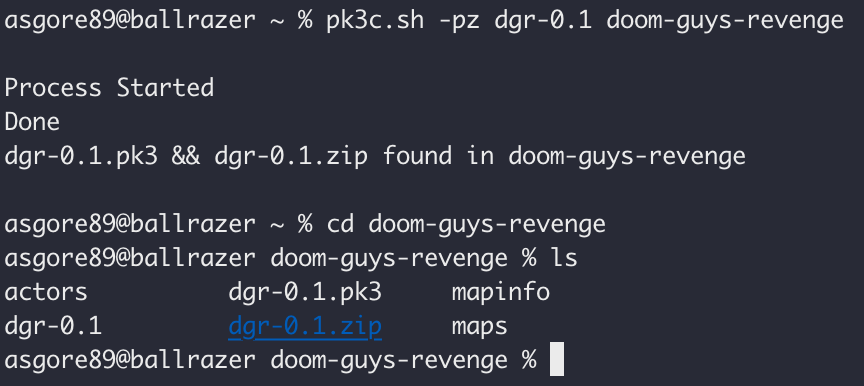

# PK3C
Converts an inputted folder into a just .pk3 or a .pk3 & a .zip 
This is a terminal application btw

Download pk3c.zip and unzip it 
go into your terminal and run ./install.sh 
you might be prompted to enter your password, and if so enter it 
once the installation finishes, you'll have to put 'export PATH=$PATH:/opt/pk3c' into line 1 of your shell rc file (.zshrc, .bashrc, etc) 
then if should work! 
to run it, just type in 'pk3c.sh' anywhere in the terminal! 

and</bold> a pk3 file

Thank you for using! 
Created by Relic374 
Feel free to distribute with credit given 
